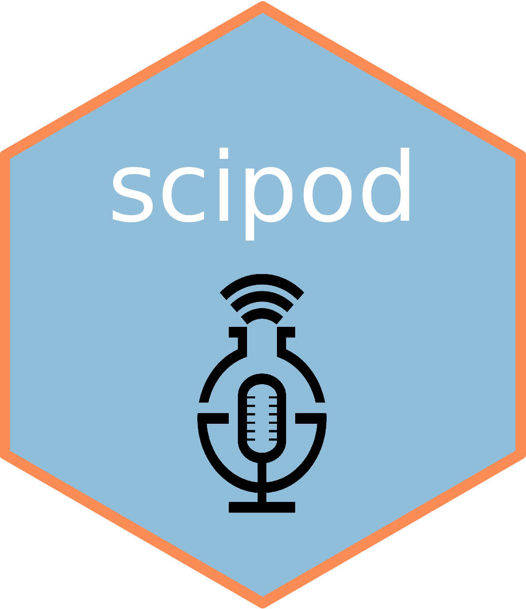

```{r out.width='100%', echo = FALSE}
#| column: margin

```

**'Etwas zum Anfassen erzeugen'** - Runde 3 -> Neues Jahr, neues Thema - in diesem Jahr haben wir Risikokommunikation behandelt. Wieder sind spannende Themen entstanden!

Hier sind die **Ergebnisse** dieser Runde zum Nachhören:

# Podcasts

[Brain_Bites](podcasts/1_Brain_Bites.mp3)<br>
[Denkstoff](podcasts/2_Denkstoff.mp3)<br>
[Spaghettiturm](podcasts/3_Spaghettiturm.mp3)<br>
[Bauchgefühl](podcasts/4_Bauchgefuehl.mpeg)<br>
[Gruppe5](podcasts/5_Gruppe5.mp3)<br>
[Gruppe6](podcasts/6_Gruppe6.mp3)<br>
[Gruppe7](podcasts/7_Gruppe7.mp3)<br>

# References

Gigerenzer, G. (2026). Risk communication: Truth and trickery about cancer screening. In T. Reimer, L. van Swol, & A. Florack (Eds.), *The Routledge handbook of communication and social cognition* (pp. 367-387). Routledge.
