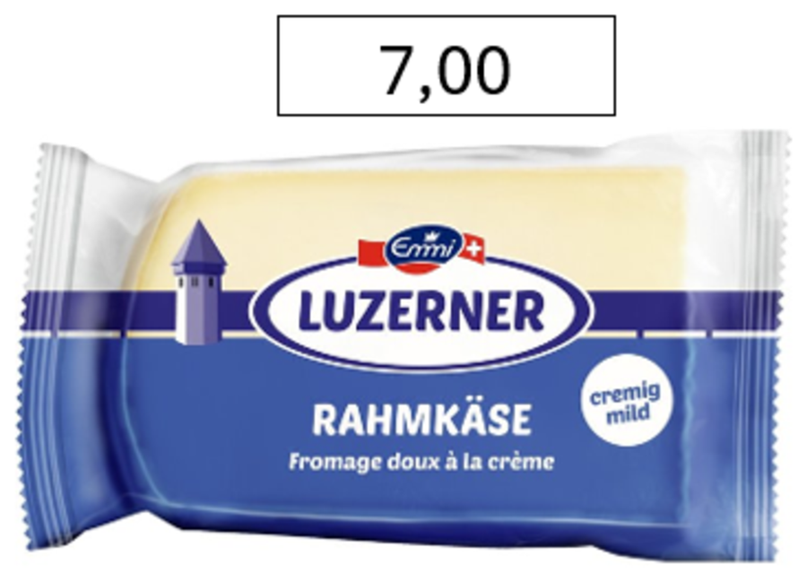
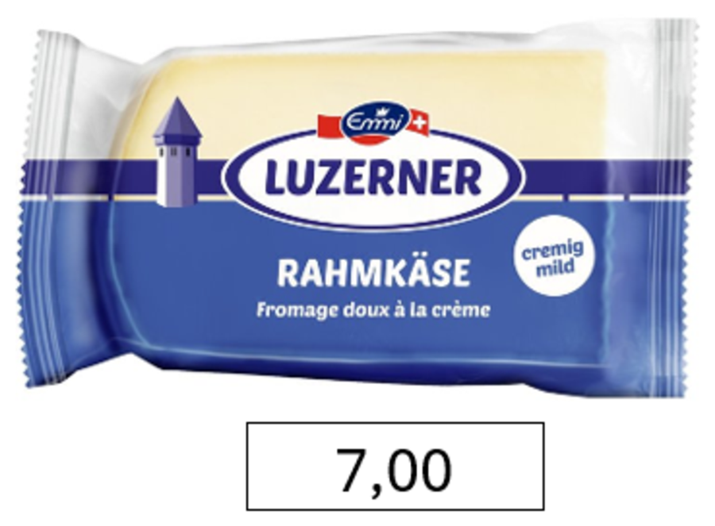

```{r setup, include=FALSE}
knitr::opts_chunk$set(echo = FALSE,
                      eval = TRUE,
                      warning = FALSE,
                      message = FALSE,
                      comment = NA,
                      fig.width = 8,
                      fig.height = 6,
                      fig.align = 'center',
                      fig.path = "static")
library(tidyverse)
library(knitr)
library(here)
library(lme4)
library(lmerTest)
library(emmeans)
library(effectsize)

group <- 'BAHS2025'

# Shareable version, one row per answer, no demographics
public <- read_csv(here(paste0('0_data/', group, '_public.csv')))
# Sample description, kept out of the public file
internal <- read_csv(here(paste0('0_data/', group, '_internal.csv')))

# One colour for each price location, used in every figure below.
pos_cols <- c('above' = '#D55E00', 'below' = '#0072B2')

# Studies 1a, 1b and 2 share the position x product design. Study 5 reuses the
# position column for its four metaphor items, so it is left untranslated here.
main <-
  public %>%
  filter(study %in% c('1a', '1b', '2')) %>%
  mutate(
    position = dplyr::recode(position, oben = 'above', unten = 'below'),
    product  = dplyr::recode(price, A = 'Everyday product', L = 'Luxury product'))

main5 <- public %>% filter(study == '5')

# Study 1a is analysed on the log scale throughout; the eight non-positive
# estimates cannot be logged and drop out here.
d1a <-
  main %>%
  filter(study == '1a', answers > 0) %>%
  mutate(log_answer = log(answers))

# Mean with a 95% confidence interval, used by every figure and table.
summarise_ci <- function(d, ...) {
  d %>%
    group_by(...) %>%
    summarise(
      n  = n(),
      mean = mean(answers),
      sd = sd(answers),
      se = sd / sqrt(n),
      ci_lower = mean - qt(0.975, n - 1) * se,
      ci_upper = mean + qt(0.975, n - 1) * se,
      .groups = 'drop')
}

# ---------------------------------------------------------------- reporting

dec <- function(x) sub('^(-?)0\\.', '\\1.', sprintf('%.3f', x))
df_txt <- function(x) {
  if (isTRUE(all.equal(x, round(x)))) sprintf('%d', round(x)) else sprintf('%.1f', x)
}

# F test from a mixed model, with partial eta squared and its two-sided CI, so
# the numbers in the text come from the data rather than being typed in.
fmt_F <- function(model, term, md = TRUE) {
  a <- anova(model)
  i <- which(trimws(rownames(a)) == term)
  f <- a$`F value`[i]; df1 <- a$NumDF[i]; df2 <- a$DenDF[i]; p <- a$`Pr(>F)`[i]
  es <- F_to_eta2(f, df1, df2, ci = 0.95, alternative = 'two.sided')
  p_txt <- if (p < .001) 'p < .001' else paste0('p = ', dec(p))
  if (md) {
    sprintf('*F*(%d, %s) = %.2f, *%s*, $\\eta^2_p$ = %s, 95%% CI [%s, %s]',
            df1, df_txt(df2), f, p_txt,
            dec(es$Eta2_partial), dec(es$CI_low), dec(es$CI_high))
  } else {
    sprintf('F(%d, %s) = %.2f, %s, η²p = %s [%s, %s]',
            df1, df_txt(df2), f, p_txt,
            dec(es$Eta2_partial), dec(es$CI_low), dec(es$CI_high))
  }
}

# Estimated marginal mean difference between the two levels of `position`,
# averaged over product type, with its 95% CI. `flip` reverses the direction so
# the difference reads "below minus above"; `log_scale` reports it as a percent.
fmt_diff <- function(model, flip = TRUE, log_scale = FALSE) {
  ct <- as.data.frame(confint(contrast(emmeans(model, ~ position), 'pairwise')))
  est <- ct$estimate[1]; lo <- ct$lower.CL[1]; hi <- ct$upper.CL[1]
  if (flip) { new_lo <- -hi; hi <- -lo; lo <- new_lo; est <- -est }
  if (log_scale) {
    pc <- function(z) sprintf('%+.1f%%', 100 * (exp(z) - 1))
    sprintf('%s, 95%% CI [%s, %s]', pc(est), pc(lo), pc(hi))
  } else {
    sprintf('%+.2f, 95%% CI [%+.2f, %+.2f]', est, lo, hi)
  }
}

options(digits = 3)
options(scipen = 999)
```

# Original work

Barone, M. J., Coulter, K. S., & Li, X. (2020). [The upside of down: Presenting a price in a low or high location influences how consumers evaluate it](https://doi.org/10.1016/j.jretai.2020.03.001). *Journal of Retailing*, 96(3), 397-410.

## Abstract

> Can changing the vertical location of a price (e.g., presenting it above or below a product image in an advertisement or retail display) influence consumer response? Drawing from conceptual metaphor theory, we propose that a price's vertical location can activate metaphors that relate vertical locations to magnitudinal concepts. These "down = less" and "up = more" metaphors can subsequently influence evaluations of a target price as being monetarily low or high in magnitude. Consistent with this premise, several lab and field investigations demonstrate that prices provided in low (vs. high) locations lead to lower price perceptions, more favorable purchase intentions, and higher in-store sales.

# Team BA autumn 2025

- Patrick Bargetze
- Alina Bösiger
- Sebastian Löpfe
- Anastasiia Lykholai
- Sarina Menning
- Flavian Römer
- Filip Stojanovic

# The idea

Do we read a price the way we read a thermometer? Up means more, down means less. Barone and colleagues asked what happens when that metaphor is quietly attached to a price tag: put the same price *below* a product rather than *above* it, and the "down = less" association should make it feel like a smaller number. Nothing about the price changes -- only where on the screen the number sits.

That is the entire manipulation. @fig-stimuli shows one of our stimuli, the identical product at the identical price of CHF 7.00, in the two conditions participants could see.

::: {#fig-stimuli layout-ncol=2}
{#fig-stim-above}

{#fig-stim-below}

The price location manipulation. Same product, same price, different vertical position.
:::

We replicated four of the original studies. Everyone saw all four, and was randomly assigned to a price location within each one. The three product studies were shown in a random order, with the metaphor questions always last:

- **Study 1a** -- no price is shown. Participants write down the price they think is appropriate, in an empty box placed either above or below the product image.
- **Study 1b** -- a price is shown. Participants rate how low or high they find it (1 = very low, 9 = very high).
- **Study 2** -- a price is shown. Participants rate how likely they would be to buy the product (1 = very unlikely, 9 = very likely).
- **Study 5** -- no products. Participants report directly how strongly they hold the "up = more" and "down = less" associations.

We crossed price location with product type in studies 1a, 1b and 2: five everyday products (cheese, toothpaste, instant coffee, a cleaning sponge, a power strip) and five luxury products (a Tesla, a Jura coffee machine, a cashmere jumper, Dior lip balm, a Roja diffuser). The original used a single product category per study, so the product factor is our addition -- it lets us ask whether the effect survives across very different price ranges.

Because the three product studies were rotated, we can also check whether it matters [when](#does-it-matter-when-a-study-appears) in the questionnaire a study appeared.

## How we analyse this

Two features of the design decide the statistics, and both are easy to get wrong.

First, everyone answered five items per study, so the rows in our data are not independent -- five of them belong to the same person. Treating them as independent would inflate the degrees of freedom roughly fivefold and shrink every *p* value with it. Every model below is therefore a linear mixed model with a random intercept per participant.

Second, product type has to be *in* the model rather than in front of it. Assignment was random but not stratified, so the two location conditions ended up with slightly different product mixes: in Study 1a, `r round(100*mean(filter(d1a, position == 'above')$price == 'L'))`% of the estimates in the above condition were for luxury products against `r round(100*mean(filter(d1a, position == 'below')$price == 'L'))`% in the below condition. Luxury items cost roughly twenty times more, so a few percentage points of composition difference is easily enough to fake a location effect. Testing location *adjusted for* product type removes that. The alternative -- entering location first in a sequential (Type I) ANOVA -- credits it with the imbalance and produces significant results that vanish the moment you control for what was actually being priced.

We report each effect as an *F* test with partial eta squared and its 95% confidence interval, plus the estimated marginal mean difference between the two locations, averaged over product type.

# Sample

```{r}
# Counts before exclusion come from the raw Qualtrics export, which is not
# published; the file below contains the analysed sample only.
n_total <- 357
n_checks <- 284
n_final <- length(internal$ID)
```

We recruited through word of mouth among friends of the student group. `r n_total` people opened the questionnaire. Of those, `r n_checks` answered at least one of the three attention checks correctly, and `r n_final` of them also reached the end of the questionnaire. Those **`r n_final` participants** make up the analysed sample.

The attention checks were the usual instructed-response items -- a question about the colour of the sun that asks you to tick "blue", for instance. Requiring only one of three to be correct is a lenient rule, and it is the rule the original analysis used, so we kept it here rather than tightening it after the fact. It is worth knowing that it does most of its work in combination with the completion filter: of the `r n_checks` who passed a check, `r n_checks - n_final` dropped out before the end.

```{r}
#| label: tbl-demo
#| tbl-cap: "Participants by gender."
internal %>%
  mutate(gender = dplyr::recode(gender,
                                weiblich = 'Female',
                                `männlich` = 'Male',
                                diverse = 'Non-binary')) %>%
  group_by(Gender = gender) %>%
  summarise(n = n(),
            `Mean age` = round(mean(age, na.rm = TRUE), 1),
            `SD age` = round(sd(age, na.rm = TRUE), 1),
            .groups = 'drop') %>%
  kable()
```

The sample is skewed toward female and young (@tbl-demo). The three non-binary participants are too few to interpret on their own, and their mean age is pulled around by a single very old respondent.

# Study 1a -- estimating a price from scratch

Participants saw a product with an empty box either above or below it, and wrote in the price they considered appropriate. If "down = less" is doing any work, the estimates written into a low box should come out smaller.

```{r}
#| label: range-1a
chf <- function(x) format(round(x), big.mark = ',', scientific = FALSE, trim = TRUE)
est_1a <- filter(main, study == '1a')$answers
lux_1a <- filter(main, study == '1a', price == 'L')$answers
```

Free-text prices are messy. Ours ranged from CHF `r chf(min(est_1a))` to CHF `r chf(max(est_1a))`, and the standard deviation in the luxury condition (`r chf(sd(lux_1a))`) is an order of magnitude larger than the mean (@tbl-1a-raw). A handful of people valuing the Tesla at several million francs is enough to swamp everything else.

```{r}
#| label: tbl-1a-raw
#| tbl-cap: "Study 1a: raw price estimates in CHF."
main %>%
  filter(study == '1a') %>%
  summarise_ci(position, product) %>%
  transmute(Position = position, Product = product, n,
            Mean = round(mean, 1), SD = round(sd, 1)) %>%
  kable()
```

The original paper hit the same problem and log-transformed the estimates, so we do the same. On the log scale a franc difference counts the same whether it sits on a tube of toothpaste or on a car.

```{r}
#| label: fig-1a
#| fig-cap: "Study 1a: estimated price by price location and product type. Mean with 95% CI, log scale."
d1a %>%
  group_by(position, product) %>%
  summarise(
    n = n(),
    mean = mean(log_answer),
    se = sd(log_answer) / sqrt(n),
    ci_lower = mean - qt(0.975, n - 1) * se,
    ci_upper = mean + qt(0.975, n - 1) * se,
    .groups = 'drop') %>%
  mutate(across(c(mean, ci_lower, ci_upper), exp)) %>%
  ggplot(aes(x = position, y = mean, colour = position)) +
  geom_point(size = 5) +
  geom_errorbar(aes(ymin = ci_lower, ymax = ci_upper), width = 0.15, linewidth = 0.8) +
  scale_colour_manual(values = pos_cols) +
  scale_y_log10(labels = scales::label_comma()) +
  facet_wrap(~ product, scales = 'free_y') +
  labs(x = 'Price location', y = 'CHF') +
  theme_minimal(base_size = 18) +
  theme(legend.position = 'none')
```

```{r}
#| label: tbl-1a-log
#| tbl-cap: "Study 1a: geometric means of the price estimates."
d1a %>%
  group_by(position, product) %>%
  summarise(n = n(),
            `Mean (CHF)` = round(exp(mean(log_answer)), 2),
            .groups = 'drop') %>%
  rename(Position = position, Product = product) %>%
  kable()
```

```{r}
#| label: m-1a
m_1a <- lmer(log_answer ~ position + price + (1 | ID), data = d1a)
```

@fig-1a and @tbl-1a-log show estimates that are a shade lower in the below condition for both product types, which is the direction the original predicts. The test does not back it up: `r fmt_F(m_1a, 'position')`. The estimated difference is `r fmt_diff(m_1a, log_scale = TRUE)` -- prices in a low box come out lower on average, but the interval comfortably contains zero and both plausible directions. Product type, by contrast, does what you would expect of it (`r fmt_F(m_1a, 'price')`); people know a Tesla costs more than toothpaste.

**Study 1a does not replicate.**

# Study 1b -- judging a price that is shown

Here the price was given and participants rated how low or high it felt. This is the most direct test of the original claim, and the one where we expected the clearest answer.

```{r}
#| label: fig-1b
#| fig-cap: "Study 1b: perceived price magnitude by price location and product type. Mean with 95% CI (1 = very low, 9 = very high)."
main %>%
  filter(study == '1b') %>%
  summarise_ci(position, product) %>%
  ggplot(aes(x = position, y = mean, colour = position)) +
  geom_point(size = 5) +
  geom_errorbar(aes(ymin = ci_lower, ymax = ci_upper), width = 0.15, linewidth = 0.8) +
  scale_colour_manual(values = pos_cols) +
  facet_wrap(~ product) +
  ylim(1, 9) +
  labs(x = 'Price location', y = 'Rating') +
  theme_minimal(base_size = 18) +
  theme(legend.position = 'none')
```

```{r}
#| label: tbl-1b
#| tbl-cap: "Study 1b: perceived price magnitude."
main %>%
  filter(study == '1b') %>%
  summarise_ci(position, product) %>%
  transmute(Position = position, Product = product, n,
            Mean = round(mean, 2), SD = round(sd, 2)) %>%
  kable()
```

```{r}
#| label: m-1b
m_1b <- lmer(answers ~ position + price + (1 | ID), data = filter(main, study == '1b'))

cell <- function(st, pos, prod) {
  d <- main %>% filter(study == st, position == pos, product == prod)
  sprintf('%.2f', mean(d$answers))
}
```

Nothing, and this time not even a hint of a direction. The two locations land on top of each other for everyday products (`r cell('1b', 'above', 'Everyday product')` versus `r cell('1b', 'below', 'Everyday product')`) and, if anything, the low price is rated *higher* for luxury products (`r cell('1b', 'above', 'Luxury product')` versus `r cell('1b', 'below', 'Luxury product')`), which runs against the prediction (@fig-1b, @tbl-1b). The model agrees: `r fmt_F(m_1b, 'position')`, an estimated difference of `r fmt_diff(m_1b)` on the nine-point scale. The product manipulation meanwhile works exactly as expected (`r fmt_F(m_1b, 'price')`) -- so the measure is clearly sensitive, just not to price location.

The original reports a significant effect here (*F*(1, 203) = 4.36, *p* = .04) on a sample half the size of ours. We have power on our side and we do not find the effect.

**Study 1b does not replicate.**

# Study 2 -- purchase intention

Same setup as 1b, but participants rated how likely they would be to buy rather than how expensive it looked. The original argued that a price which feels smaller should translate into stronger intentions to buy.

```{r}
#| label: fig-2
#| fig-cap: "Study 2: purchase intention by price location and product type. Mean with 95% CI (1 = very unlikely, 9 = very likely)."
main %>%
  filter(study == '2') %>%
  summarise_ci(position, product) %>%
  ggplot(aes(x = position, y = mean, colour = position)) +
  geom_point(size = 5) +
  geom_errorbar(aes(ymin = ci_lower, ymax = ci_upper), width = 0.15, linewidth = 0.8) +
  scale_colour_manual(values = pos_cols) +
  facet_wrap(~ product) +
  ylim(1, 9) +
  labs(x = 'Price location', y = 'Rating') +
  theme_minimal(base_size = 18) +
  theme(legend.position = 'none')
```

```{r}
#| label: tbl-2
#| tbl-cap: "Study 2: purchase intention."
main %>%
  filter(study == '2') %>%
  summarise_ci(position, product) %>%
  transmute(Position = position, Product = product, n,
            Mean = round(mean, 2), SD = round(sd, 2)) %>%
  kable()
```

```{r}
#| label: m-2
m_2 <- lmer(answers ~ position + price + (1 | ID), data = filter(main, study == '2'))
```

This is the closest we come. Participants were somewhat more willing to buy when the price sat below the product, for everyday products (`r cell('2', 'above', 'Everyday product')` versus `r cell('2', 'below', 'Everyday product')`) and luxury products (`r cell('2', 'above', 'Luxury product')` versus `r cell('2', 'below', 'Luxury product')`) alike (@fig-2, @tbl-2). The estimated difference, `r fmt_diff(m_2)` on the nine-point scale, runs in the predicted direction and is the largest of the three studies, but the interval still includes zero and the test is not significant: `r fmt_F(m_2, 'position')`.

That is worth being precise about. A consistent direction across two product categories is the kind of thing that makes you want to believe an effect is there, and it may well be -- our interval is compatible with an effect of up to two thirds of a scale point. It is also compatible with nothing at all, and with a small effect in the opposite direction. This study does not settle the question.

The low purchase intentions for luxury products most likely goes back to our sample of students - being asked whether they would buy a Tesla; a mean of about 2 on a 9-point scale is a statement about budgets rather than about design.

**Study 2 does not replicate.**

# Study 5 -- do people hold the metaphor at all?

The whole account rests on people associating up with more and down with less. Study 5 measures that directly, with four statements rated from 1 to 9. The first two ask what "up" and "down" bring to mind (1 = less of something, 9 = more of something); the last two ask for agreement that a lower position means less and a higher position means more.

Because every participant answered all four statements, these are within-person comparisons, and the mixed model uses that pairing.

```{r}
#| label: fig-5
#| fig-cap: "Study 5: strength of the vertical metaphor across the four statements. Mean with 95% CI."
item_labels <- c(
  oben    = '"Up" means more',
  unten   = '"Down" means less',
  hoeher  = 'Higher = more',
  niedrig = 'Lower = less')

blocks <- c('Association (1 = less, 9 = more)', 'Agreement (1 = none, 9 = full)')

main5 %>%
  summarise_ci(position) %>%
  mutate(label = factor(item_labels[position], levels = item_labels),
         block = factor(if_else(position %in% c('oben', 'unten'),
                                blocks[1], blocks[2]),
                        levels = blocks)) %>%
  ggplot(aes(x = label, y = mean, colour = block)) +
  geom_point(size = 5) +
  geom_errorbar(aes(ymin = ci_lower, ymax = ci_upper), width = 0.15, linewidth = 0.8) +
  scale_colour_manual(values = setNames(c('#009E73', '#CC79A7'), blocks)) +
  ylim(1, 9) +
  labs(x = NULL, y = 'Rating', colour = NULL) +
  theme_minimal(base_size = 18) +
  theme(legend.position = 'bottom',
        axis.text.x = element_text(angle = 20, hjust = 1))
```

```{r}
#| label: tbl-5
#| tbl-cap: "Study 5: metaphor strength."
main5 %>%
  summarise_ci(position) %>%
  mutate(Item = factor(item_labels[position], levels = item_labels)) %>%
  arrange(Item) %>%
  transmute(Item, n, Mean = round(mean, 2), SD = round(sd, 2)) %>%
  kable()
```

```{r}
#| label: m-5
m_5_updown <- lmer(answers ~ position + (1 | ID),
                   data = filter(main5, position %in% c('oben', 'unten')))
m_5_agree  <- lmer(answers ~ position + (1 | ID),
                   data = filter(main5, position %in% c('hoeher', 'niedrig')))

m5 <- function(pos) sprintf('%.2f', mean(main5$answers[main5$position == pos]))

diff5 <- function(model) {
  ct <- as.data.frame(confint(contrast(emmeans(model, ~ position), 'pairwise')))
  sprintf('%.2f, 95%% CI [%.2f, %.2f]', ct$estimate[1], ct$lower.CL[1], ct$upper.CL[1])
}
```

The metaphor is there, and unlike everything above it is not in doubt (@fig-5, @tbl-5). "Up" sits at `r m5('oben')` and "down" at `r m5('unten')` on the same scale, a gap of `r diff5(m_5_updown)` on the nine-point scale (`r fmt_F(m_5_updown, 'position')`). Asked directly, people also agree that higher means more (`r m5('hoeher')`) more strongly than that lower means less (`r m5('niedrig')`), a smaller but reliable gap of `r diff5(m_5_agree)` (`r fmt_F(m_5_agree, 'position')`).

So the central ingredient the theory needs is present in our sample, at full strength. What does not follow is the behaviour it is supposed to produce.

# Does it matter when a study appears?

Studies 1a, 1b and 2 were rotated, so each one landed first, second or third for roughly a third of participants. That gives us a free check on something replications rarely get to look at: whether the position of a study inside the questionnaire changes what it finds.

```{r}
#| label: fig-order
#| fig-cap: "Answers by the position a study occupied in the questionnaire. Mean with 95% CI, collapsed across product type. Study 1a is on the log scale."
bind_rows(
  d1a %>% transmute(study = 'Study 1a (log CHF)', order, position,
                    answers = log_answer),
  main %>% filter(study %in% c('1b', '2')) %>%
    transmute(study = dplyr::recode(study,
                                    `1b` = 'Study 1b (rating)',
                                    `2`  = 'Study 2 (rating)'),
              order, position, answers)) %>%
  filter(!is.na(order)) %>%
  summarise_ci(study, order, position) %>%
  ggplot(aes(x = factor(order), y = mean, colour = position)) +
  geom_point(size = 4, position = position_dodge(width = 0.4)) +
  geom_errorbar(aes(ymin = ci_lower, ymax = ci_upper), width = 0.15,
                linewidth = 0.8, position = position_dodge(width = 0.4)) +
  scale_colour_manual(values = pos_cols) +
  facet_wrap(~ study, scales = 'free_y') +
  labs(x = 'Shown first, second or third', y = NULL, colour = 'Price location') +
  theme_minimal(base_size = 16) +
  theme(legend.position = 'bottom')
```

```{r}
#| label: m-order
m_ord <- list(
  `1a` = lmer(log_answer ~ position * order + price + (1 | ID), data = d1a),
  `1b` = lmer(answers ~ position * order + price + (1 | ID),
              data = filter(main, study == '1b')),
  `2`  = lmer(answers ~ position * order + price + (1 | ID),
              data = filter(main, study == '2')))
```

```{r}
#| label: tbl-order
#| tbl-cap: "Task order added to each model."
tibble(
  Study = c('1a -- price estimation', '1b -- price magnitude', '2 -- purchase intention'),
  `Effect of order` = map_chr(m_ord, fmt_F, term = 'order', md = FALSE),
  `Location x order` = map_chr(m_ord, fmt_F, term = 'position:order', md = FALSE)) %>%
  kable()
```

Two things fall out of @fig-order and @tbl-order.

The first is that order matters in Study 2. Purchase intentions were markedly lower when Study 2 came first than when it came later (`r fmt_F(m_ord[['2']], 'order')`). Studies 1a and 1b show nothing of the sort (`r fmt_F(m_ord[['1a']], 'order')` and `r fmt_F(m_ord[['1b']], 'order')`). The most likely reading is warm-up: participants who had already worked through a block of prices had a rough sense of what these products cost, and answered the buying question less conservatively than those who met the Tesla cold.

The second is that order does *not* interact with price location in any of the three studies (all *p* > .36). Whatever the rotation is doing to the overall level of responses, it is doing it equally to the above and below conditions. So the rotation is neither creating nor concealing a location effect -- the nulls above are not an artefact of when people saw what.

Worth keeping in mind if you run something like this yourself. A rotation costs nothing and buys you the ability to tell "my effect" apart from "my questionnaire".

# Where that leaves us

```{r}
#| label: tbl-summary
#| tbl-cap: "Original findings and our replication."
tibble(
  Study = c('1a -- price estimation',
            '1b -- price magnitude',
            '2 -- purchase intention',
            '5 -- metaphor strength'),
  Original = c('F(2, 88) = 3.55, p = .03',
               'F(1, 203) = 4.36, p = .04',
               'F(2, 86) = 4.14, p = .02',
               'held by participants'),
  Replication = c(fmt_F(m_1a, 'position', md = FALSE),
                  fmt_F(m_1b, 'position', md = FALSE),
                  fmt_F(m_2, 'position', md = FALSE),
                  fmt_F(m_5_updown, 'position', md = FALSE)),
  Outcome = c('not replicated', 'not replicated', 'not replicated', 'replicated')
) %>%
  kable()
```

@tbl-summary is not the result we expected when we started. People in our sample hold the "up = more, down = less" metaphor about as strongly as it is possible to hold anything on a nine-point scale. It simply does not travel to their prices. Estimating a price from scratch, judging a price on the page, deciding whether to buy -- in all three the confidence interval for the location effect straddles zero.

The direction is not random, for what that is worth. Two of the three point the way the original predicted, and Study 2's difference of about a quarter of a scale point is the sort of effect the original was describing. With 219 participants we could not separate it from noise, and an effect that needs more than this to show itself is not the effect the original reported.

Caveats. Our design differs from the original: we ran all four studies on the same participants rather than using a fresh sample for each, we recruited a Swiss convenience sample rather than US students and mTurk workers (although you probably would not want to do that anyway today), and we added a product-type factor the original did not have. Any of those could explain why we see nothing where the original saw something. The rotation at least lets us rule out running order as the culprit.

Price location may still do something. On this evidence, whatever it does is smaller than a study of this size can see.

# Data

The anonymised responses behind every figure and table on this page are in [`BAHS2025_public.csv`](https://github.com/michaelschulte/web20/blob/main/0_data/BAHS2025_public.csv): one row per answer, with the participant's random `ID`, the `study`, the price `position`, the product type (`price`: A for everyday, L for luxury), the item (`level`), the serial position of that study in the questionnaire (`order`) and the `answers` themselves. Gender and age are held back and are not published.
